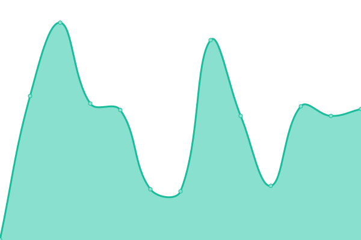
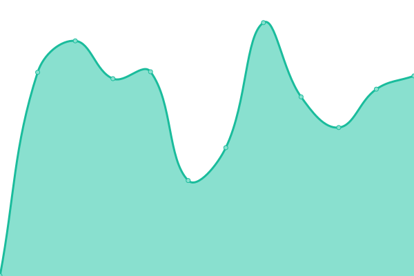

# [📈 Live Status](https://jpleasants.github.io/upptime): <!--live status--> **🟧 Partial outage**

This repository contains the open-source uptime monitor and status page for [jpleasants](https://jpleasants.github.io/upptime), powered by [Upptime](https://github.com/upptime/upptime).

With [Upptime](https://upptime.js.org), you can get your own unlimited and free uptime monitor and status page, powered entirely by a GitHub repository. We use [Issues](https://github.com/jpleasants/upptime/issues) as incident reports, [Actions](https://github.com/jpleasants/upptime/actions) as uptime monitors, and [Pages](https://jpleasants.github.io/upptime) for the status page.

<!--start: status pages-->
<!-- This summary is generated by Upptime (https://github.com/upptime/upptime) -->
<!-- Do not edit this manually, your changes will be overwritten -->
<!-- prettier-ignore -->
| URL | Status | History | Response Time | Uptime |
| --- | ------ | ------- | ------------- | ------ |
|  [SAM IT Solutions](https://samitsolutions.com) | 🟩 Up | [sam-it-solutions.yml](https://github.com/jpleasants/upptime/commits/HEAD/history/sam-it-solutions.yml) | 

 364ms
     
 | 

<a href="https://jpleasants.github.io/upptime/history/sam-it-solutions">100.00%</a>
    

|  [Plesk 2](https://plesk2.samitsolutions.com) | 🟩 Up | [plesk-2.yml](https://github.com/jpleasants/upptime/commits/HEAD/history/plesk-2.yml) | 

 677ms
     
 | 

<a href="https://jpleasants.github.io/upptime/history/plesk-2">100.00%</a>
    

|  [A Slice Of The Cloud](asliceofthecloud.com) | 🟩 Up | [a-slice-of-the-cloud.yml](https://github.com/jpleasants/upptime/commits/HEAD/history/a-slice-of-the-cloud.yml) | 

 4026ms
     
 | 

<a href="https://jpleasants.github.io/upptime/history/a-slice-of-the-cloud">100.00%</a>
    

|  [Basketball My World](basketballmyworld.com) | 🟩 Up | [basketball-my-world.yml](https://github.com/jpleasants/upptime/commits/HEAD/history/basketball-my-world.yml) | 

 518ms
     
 | 

<a href="https://jpleasants.github.io/upptime/history/basketball-my-world">100.00%</a>
    

|  [Bikaner Electrical](bikanerelectrical.com) | 🟥 Down | [bikaner-electrical.yml](https://github.com/jpleasants/upptime/commits/HEAD/history/bikaner-electrical.yml) | 

 0ms
     
 | 

<a href="https://jpleasants.github.io/upptime/history/bikaner-electrical">0.00%</a>
    

|  [Biryani Maxx](biryanimaxx.com) | 🟩 Up | [biryani-maxx.yml](https://github.com/jpleasants/upptime/commits/HEAD/history/biryani-maxx.yml) | 

 4647ms
     
 | 

<a href="https://jpleasants.github.io/upptime/history/biryani-maxx">100.00%</a>
    

|  [Carolina Retina Eyecare](carolinaretinaeyecare.com) | 🟩 Up | [carolina-retina-eyecare.yml](https://github.com/jpleasants/upptime/commits/HEAD/history/carolina-retina-eyecare.yml) | 

 4794ms
     
 | 

<a href="https://jpleasants.github.io/upptime/history/carolina-retina-eyecare">100.00%</a>
    

|  [Cary Endoscopy Center](caryendoscopycenter.com) | 🟩 Up | [cary-endoscopy-center.yml](https://github.com/jpleasants/upptime/commits/HEAD/history/cary-endoscopy-center.yml) | 

 3722ms
     
 | 

<a href="https://jpleasants.github.io/upptime/history/cary-endoscopy-center">100.00%</a>
    

|  [Cary Internal Medicine](caryinternalmedicine.com) | 🟩 Up | [cary-internal-medicine.yml](https://github.com/jpleasants/upptime/commits/HEAD/history/cary-internal-medicine.yml) | 

 2242ms
     
 | 

<a href="https://jpleasants.github.io/upptime/history/cary-internal-medicine">100.00%</a>
    

|  [Center For Digestive Diseases](centerfordigestivediseases.com) | 🟩 Up | [center-for-digestive-diseases.yml](https://github.com/jpleasants/upptime/commits/HEAD/history/center-for-digestive-diseases.yml) | 

 3869ms
     
 | 

<a href="https://jpleasants.github.io/upptime/history/center-for-digestive-diseases">100.00%</a>
    

|  [Cholanad](cholanad.com) | 🟩 Up | [cholanad.yml](https://github.com/jpleasants/upptime/commits/HEAD/history/cholanad.yml) | 

 1628ms
     
 | 

<a href="https://jpleasants.github.io/upptime/history/cholanad">100.00%</a>
    

|  [Civentichem](civentichem.com) | 🟩 Up | [civentichem.yml](https://github.com/jpleasants/upptime/commits/HEAD/history/civentichem.yml) | 

 3053ms
     
 | 

<a href="https://jpleasants.github.io/upptime/history/civentichem">100.00%</a>
    

|  [Clearpoint Health](clearpointhealth.com) | 🟩 Up | [clearpoint-health.yml](https://github.com/jpleasants/upptime/commits/HEAD/history/clearpoint-health.yml) | 

 5843ms
     
 | 

<a href="https://jpleasants.github.io/upptime/history/clearpoint-health">100.00%</a>
    

|  [Cloven Cardamom](clovencardamom.com) | 🟩 Up | [cloven-cardamom.yml](https://github.com/jpleasants/upptime/commits/HEAD/history/cloven-cardamom.yml) | 

 6521ms
     
 | 

<a href="https://jpleasants.github.io/upptime/history/cloven-cardamom">100.00%</a>
    

|  [Directed VR](directed-vr.com) | 🟩 Up | [directed-vr.yml](https://github.com/jpleasants/upptime/commits/HEAD/history/directed-vr.yml) | 

 3301ms
     
 | 

<a href="https://jpleasants.github.io/upptime/history/directed-vr">100.00%</a>
    

|  [DOC NC](docnc.org) | 🟩 Up | [doc-nc.yml](https://github.com/jpleasants/upptime/commits/HEAD/history/doc-nc.yml) | 

 4989ms
     
 | 

<a href="https://jpleasants.github.io/upptime/history/doc-nc">100.00%</a>
    

|  [Guru Indian Cuisine](guruindiancuisine.com) | 🟩 Up | [guru-indian-cuisine.yml](https://github.com/jpleasants/upptime/commits/HEAD/history/guru-indian-cuisine.yml) | 

 4312ms
     
 | 

<a href="https://jpleasants.github.io/upptime/history/guru-indian-cuisine">100.00%</a>
    

|  [Hcilcode](HCIL Code) | 🟥 Down | [hcilcode.yml](https://github.com/jpleasants/upptime/commits/HEAD/history/hcilcode.yml) | 

 0ms
     
 | 

<a href="https://jpleasants.github.io/upptime/history/hcilcode">0.00%</a>
    

|  [IMCS](imcs.sx) | 🟩 Up | [imcs.yml](https://github.com/jpleasants/upptime/commits/HEAD/history/imcs.yml) | 

 2656ms
     
 | 

<a href="https://jpleasants.github.io/upptime/history/imcs">100.00%</a>
    

|  [Lay Sciences](laysciences.com) | 🟩 Up | [lay-sciences.yml](https://github.com/jpleasants/upptime/commits/HEAD/history/lay-sciences.yml) | 

 332ms
     
 | 

<a href="https://jpleasants.github.io/upptime/history/lay-sciences">100.00%</a>
    

|  [Monsoon Indian Cuisine](monsoonindiancuisine.com) | 🟩 Up | [monsoon-indian-cuisine.yml](https://github.com/jpleasants/upptime/commits/HEAD/history/monsoon-indian-cuisine.yml) | 

 436ms
     
 | 

<a href="https://jpleasants.github.io/upptime/history/monsoon-indian-cuisine">100.00%</a>
    

|  [Patagonia EMR](patagoniaemr.com) | 🟩 Up | [patagonia-emr.yml](https://github.com/jpleasants/upptime/commits/HEAD/history/patagonia-emr.yml) | 

 419ms
     
 | 

<a href="https://jpleasants.github.io/upptime/history/patagonia-emr">100.00%</a>
    

|  [Patagonia Health](patagoniahealth.com) | 🟩 Up | [patagonia-health.yml](https://github.com/jpleasants/upptime/commits/HEAD/history/patagonia-health.yml) | 

 592ms
     
 | 

<a href="https://jpleasants.github.io/upptime/history/patagonia-health">100.00%</a>
    

|  [Patagonia Health Dev](dev.patagoniahealth.com) | 🟩 Up | [patagonia-health-dev.yml](https://github.com/jpleasants/upptime/commits/HEAD/history/patagonia-health-dev.yml) | 

 678ms
     
 | 

<a href="https://jpleasants.github.io/upptime/history/patagonia-health-dev">100.00%</a>
    

|  [PRDBI](prdbi.com) | 🟥 Down | [prdbi.yml](https://github.com/jpleasants/upptime/commits/HEAD/history/prdbi.yml) | 

 277ms
     
 | 

<a href="https://jpleasants.github.io/upptime/history/prdbi">0.00%</a>
    

|  [Rahul Priyadarshi](rahul-priyadarshi.net) | 🟩 Up | [rahul-priyadarshi.yml](https://github.com/jpleasants/upptime/commits/HEAD/history/rahul-priyadarshi.yml) | 

 3512ms
     
 | 

<a href="https://jpleasants.github.io/upptime/history/rahul-priyadarshi">100.00%</a>
    

|  [Sam Analytic Solutions](samanalyticsolutions.com) | 🟩 Up | [sam-analytic-solutions.yml](https://github.com/jpleasants/upptime/commits/HEAD/history/sam-analytic-solutions.yml) | 

 367ms
     
 | 

<a href="https://jpleasants.github.io/upptime/history/sam-analytic-solutions">100.00%</a>
    

|  [Tandoor Chapel Hill](tandoorchapelhill.com) | 🟩 Up | [tandoor-chapel-hill.yml](https://github.com/jpleasants/upptime/commits/HEAD/history/tandoor-chapel-hill.yml) | 

 5806ms
     
 | 

<a href="https://jpleasants.github.io/upptime/history/tandoor-chapel-hill">100.00%</a>
    

|  [Temoa Cloud](temoacloud.com) | 🟩 Up | [temoa-cloud.yml](https://github.com/jpleasants/upptime/commits/HEAD/history/temoa-cloud.yml) | 

 3582ms
     
 | 

<a href="https://jpleasants.github.io/upptime/history/temoa-cloud">100.00%</a>
    

|  [Zayka Raleigh](zaykaraleigh.com) | 🟩 Up | [zayka-raleigh.yml](https://github.com/jpleasants/upptime/commits/HEAD/history/zayka-raleigh.yml) | 

 315ms
     
 | 

<a href="https://jpleasants.github.io/upptime/history/zayka-raleigh">100.00%</a>
    

<!--end: status pages-->

[**Visit our status website →**](https://jpleasants.github.io/upptime)

## 📄 License

- Powered by: [Upptime](https://github.com/upptime/upptime)
- Code: [MIT](./LICENSE) © [jpleasants](https://jpleasants.github.io/upptime)
- Data in the `./history` directory: [Open Database License](https://opendatacommons.org/licenses/odbl/1-0/)
